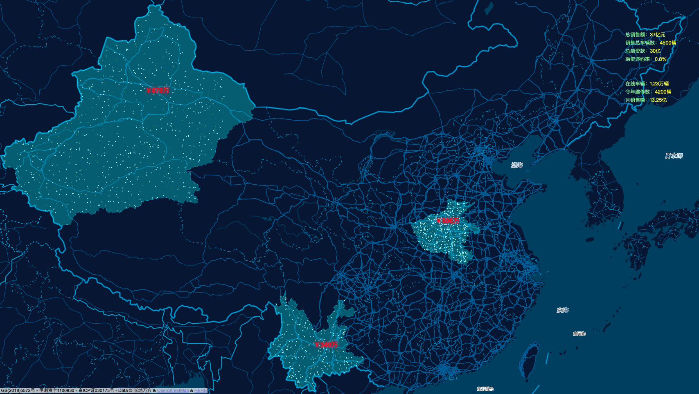
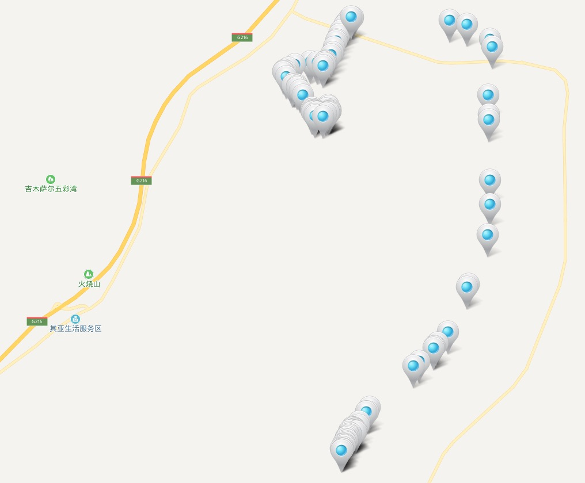
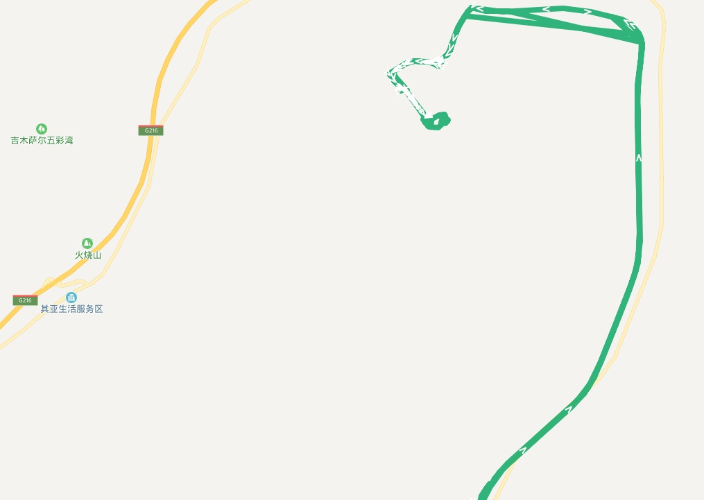
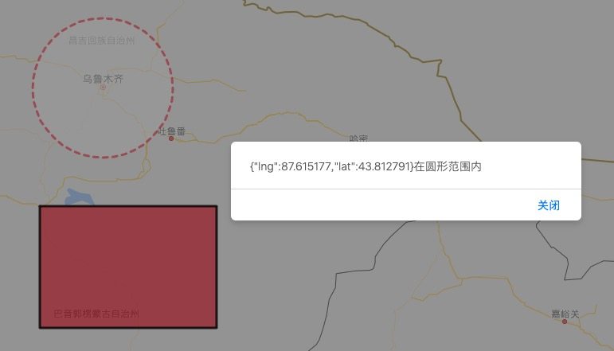
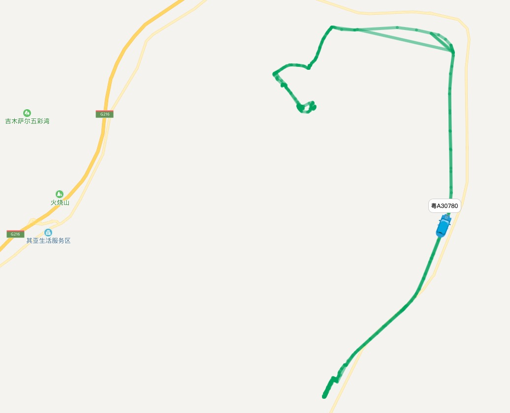
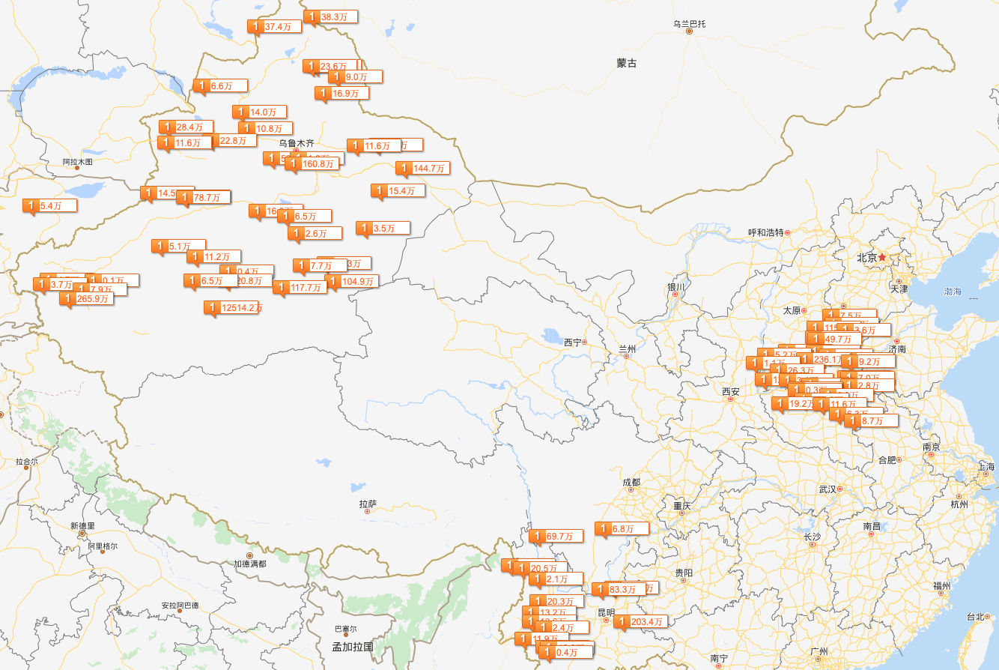
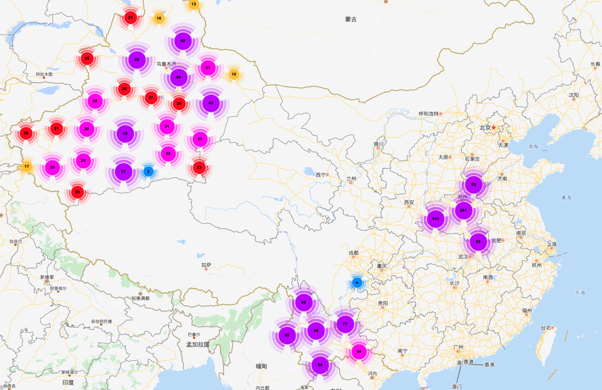

# gps地图示例

## 前言

最近工作中可能需要用到地图，就提前进行技术预言，花了两三天做了几个demo，基本能够覆盖大部分业务场景。

每个示例放在单独的文件夹中，这样可以独立运行。

## 全国数据大屏展示

<video id="video" controls="" preload="none" poster="">
<source id="mp4" src="./img/mapvDemo.mp4" type="video/mp4">
</video>

[demo地址](./gps/mapvDemo)

## 车辆轨迹

[demo地址](./gps/markerDemo)

## 车辆轨迹

[demo地址](./gps/polylineDemo)

## 电子围栏

[demo地址](./gps/electronicFence)

## 车辆轨迹播放

[demo地址](./gps/roadbook)

## 富Marker-还款剩余金额

[demo地址](./gps/richMarker)

## 车辆点聚合

[demo地址](./gps/polymerization)

